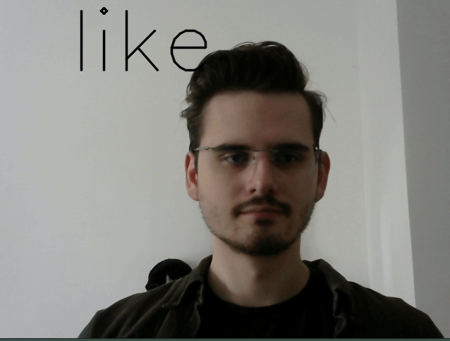

# Sign Language Translation using Machine Learning
 

  
main.py contains the the model and training code  
gstream.py contains code for webcam streaming into model inference  
reorder.py was used to create test and training csvs from a larger dataset  
resnet.py is used as a comparison model and contains constructers for the model (this code is not written by me)  
wlasldataset.py contains the dataset class for model training  
  
./datafiles contains all csv and txt files used for training and testing  
./runs contains tensorboard logs for past model training  
./videos contains all videos trained on, this is too large for upload but can be provided on request (or downloaded at https://github.com/dxli94/WLASL)  
checkpoint.pth is the training weights for the model, these are too large to upload but can be provided on request
